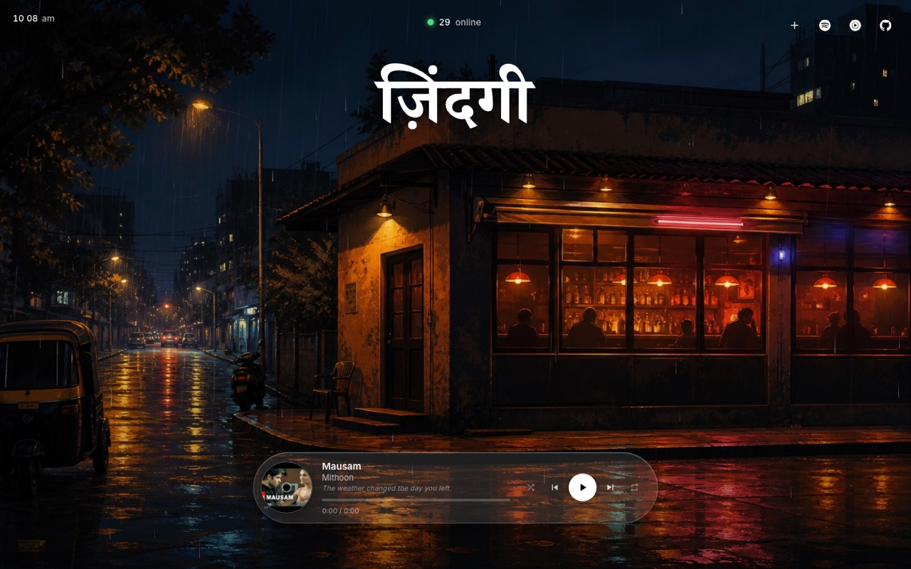

<p align="center">
  <a href="https://zindagi.wtf">
    
  </a>
</p>

# Zindagi

Late-night breakup jukebox for **[zindagi.wtf](https://zindagi.wtf)** — saloon.wtf-style player, rainy bar scene.

> GitHub READMEs can’t embed a live page (iframes are stripped), so the preview above is a screenshot that links to the live site.

## Local

```bash
npm install
npm run dev
```

## Customize

- Background: `public/bg.jpg`
- Songs: `src/tracks.js` (core list; community suggestions merge at runtime)
- Spotify / YT Music: set `SPOTIFY_URL` / `YT_MUSIC_URL` in `src/main.js`
- Suggestions: `+` in the top-right → `POST /api/suggest` (Vercel Blob queue + YouTube lookup)

## Suggestions

Plan: `docs/song-suggestions-plan.md`

- Queue + community tracks live in a private Vercel Blob store (`zindagi-data`)
- Site playlist grows when lookup succeeds; Spotify/YT Music playlists stay manual
- Lookup ranks candidates (rejects karaoke/hour-long junk; prefers official/audio)
- Fuzzy dedupe on title/artist transliterations
- Owner digest: `GET /api/suggestions` with `Authorization: Bearer $SUGGESTIONS_SECRET` (or `?secret=`)
- Local API: `npx vercel dev` (needs `.env.local` with `BLOB_READ_WRITE_TOKEN` + `SUGGESTIONS_SECRET`)

## Share

Click the vinyl to copy `https://zindagi.wtf/?t=<id>`.

## Deploy (Vercel)

1. Push to GitHub (`zindagi.wtf` repo).
2. Import the repo in Vercel (framework: Vite — auto-detected).
3. Add domain `zindagi.wtf` in **Project → Settings → Domains**.
4. In GoDaddy DNS, set the **A** / **CNAME** values Vercel shows (apex works via A record).
5. Prefer apex as primary; redirect `www` → `zindagi.wtf`.
